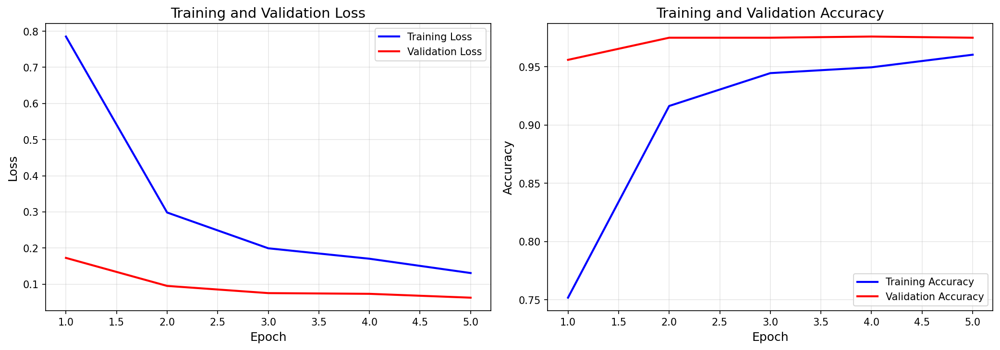
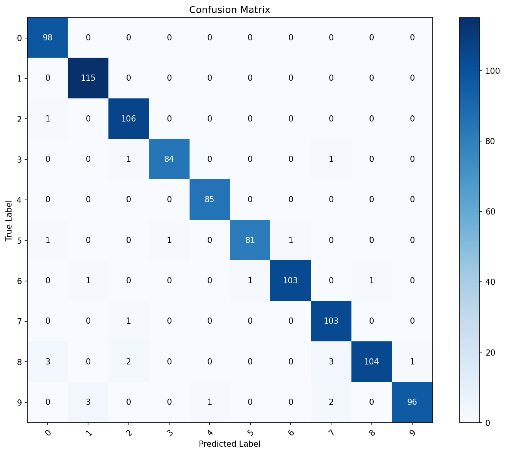
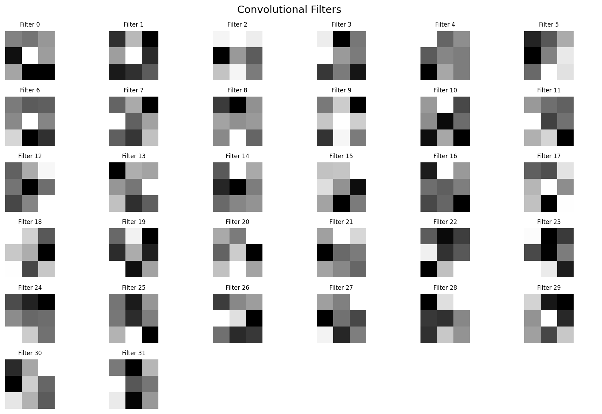
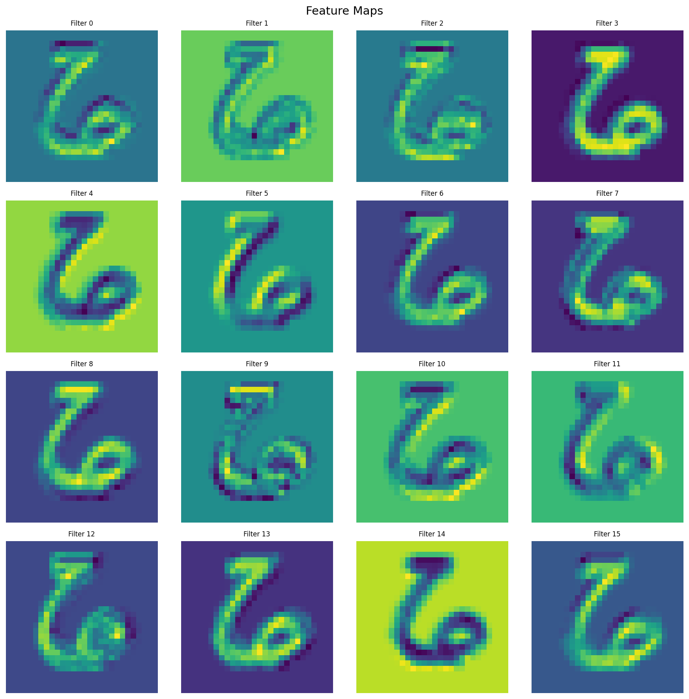
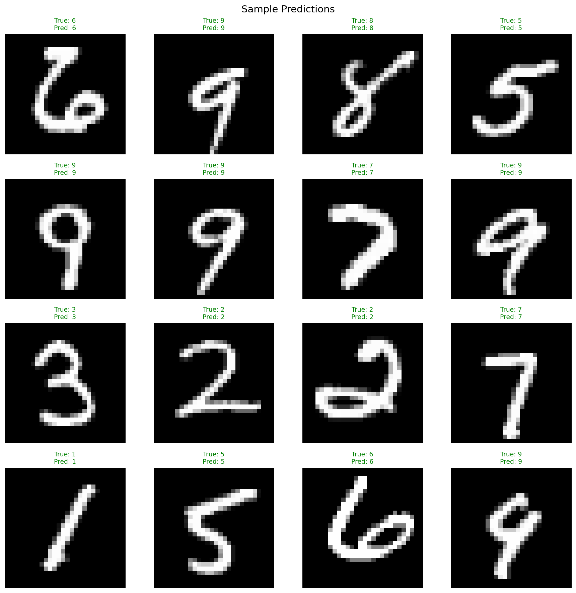

# CNN Library from Scratch

A complete implementation of **Convolutional Neural Networks (CNNs)** using **only NumPy**, alongside a PyTorch version for comparison.

This project demonstrates deep understanding of:
- **Convolutional operations**
- **Pooling operations** (Max, Average)
- **Batch Normalization** for stable training
- **Backpropagation** through all layer types
- **Visualizations** (training curves, feature maps, filters, confusion matrix)

## Visualizations

<table>
<tr>
<td><br/><b>Training Progress</b></td>
<td><br/><b>Confusion Matrix</b></td>
</tr>
<tr>
<td><br/><b>Learned Filters</b></td>
<td><br/><b>Feature Maps</b></td>
</tr>
<tr>
<td colspan="2" align="center"><br/><b>Sample Predictions</b></td>
</tr>
</table>

## Project Structure

```
CNN_Library_from_Scratch/
├── src/                         # From-scratch NumPy implementation
│   ├── __init__.py              # Package exports
│   ├── cnn.py                   # Main CNN class
│   ├── layers.py                # Conv2D, Pool, BatchNorm, Dense, Dropout, Flatten
│   ├── activations.py           # ReLU, Sigmoid, Softmax, etc.
│   ├── losses.py                # CrossEntropy, MSE
│   ├── optimizers.py            # Adam (default), SGD with momentum
│   ├── utils.py                 # Data loading, preprocessing
│   └── visualizations.py        # Plotting utilities
├── pytorch/                     # PyTorch version
│   └── cnn_pytorch.py           # PyTorch CNN model
├── tests/                       # Comprehensive test suite
│   ├── test_layers.py           # Layer unit tests
│   ├── test_gradients.py        # Numerical gradient checking
│   └── test_cnn.py              # Integration tests
├── notebooks/                   # Jupyter tutorials
│   ├── 01_from_scratch_tutorial.ipynb
│   ├── 02_pytorch_tutorial.ipynb
│   └── 03_comparison.ipynb
├── checkpoints/                  # Saved model weights
├── visualizations/               # Generated plots
├── mnist_dataset/                # MNIST data files
├── requirements.txt              # Dependencies
├── LICENSE                       # MIT License
└── README.md
```

### Download MNIST Dataset

This project requires the MNIST dataset in IDX format. Download from one of these sources:

**Option 1: Kaggle (Recommended)**
1. Go to [MNIST Dataset on Kaggle](https://www.kaggle.com/datasets/hojjatk/mnist-dataset)
2. Download and extract to `mnist_dataset/` folder

**Option 2: Original Source**
1. Go to [Yann LeCun's MNIST page](http://yann.lecun.com/exdb/mnist/)
2. Download all and extract them to `mnist_dataset/`

Your folder structure should look like:
```
mnist_dataset/
├── train-images-idx3-ubyte
├── train-labels-idx1-ubyte
├── t10k-images-idx3-ubyte
└── t10k-labels-idx1-ubyte
```

### Basic Usage

```python
from src.cnn import CNN
from src.utils import load_mnist

# Load MNIST data
X_train, y_train, X_test, y_test = load_mnist(
    'mnist_dataset', 
    subset_size=(5000, 1000)
)

# Create CNN model
model = CNN(
    input_shape=(1, 28, 28),
    num_classes=10,
    use_batchnorm=True,
    dropout_rate=0.25
)

# View model architecture
model.summary()

# Train the model
history = model.fit(
    X_train, y_train,
    epochs=20,
    batch_size=32,
    learning_rate=0.001,
    optimizer='adam',
    validation_data=(X_test, y_test)
)

# Evaluate
accuracy = model.score(X_test, y_test)
print(f"Test Accuracy: {accuracy:.2%}")

# Save model
model.save('checkpoints/cnn_mnist.npz')
```

## Architecture

The default CNN architecture:

```
Input (1, 28, 28)
       ↓
┌─────────────────────────────────────────────────┐
│  Block 1                                        │
│  Conv2D(32, 3×3) → BatchNorm → ReLU             │
│  Conv2D(32, 3×3) → BatchNorm → ReLU             │
│  MaxPool(2×2) → Dropout2D(0.25)                 │
└─────────────────────────────────────────────────┘
       ↓ (32, 14, 14)
┌─────────────────────────────────────────────────┐
│  Block 2                                        │
│  Conv2D(64, 3×3) → BatchNorm → ReLU             │
│  Conv2D(64, 3×3) → BatchNorm → ReLU             │
│  MaxPool(2×2) → Dropout2D(0.25)                 │
└─────────────────────────────────────────────────┘
       ↓ (64, 7, 7)
┌─────────────────────────────────────────────────┐
│  Classifier                                     │
│  Flatten → Dense(128) → BatchNorm → ReLU        │
│  Dropout(0.5) → Dense(10) → Softmax             │
└─────────────────────────────────────────────────┘
       ↓
Output: 10 class probabilities
```

## Mathematical Background

### 2D Convolution

The core operation of CNNs. For input $X$ and kernel $W$:

$$\text{output}[b, f, i, j] = \sum_{c=0}^{C_{in}-1} \sum_{k_h=0}^{K_H-1} \sum_{k_w=0}^{K_W-1} X[b, c, i \cdot s + k_h, j \cdot s + k_w] \cdot W[f, c, k_h, k_w] + b[f]$$

Where:
- $b$: batch index
- $f$: output filter index
- $c$: input channel index
- $i, j$: spatial output position
- $s$: stride
- $K_H, K_W$: kernel dimensions

### Backpropagation through Conv2D

**Gradient w.r.t. weights:**
$$\frac{\partial L}{\partial W[f,c,k_h,k_w]} = \sum_{b,i,j} \frac{\partial L}{\partial \text{out}[b,f,i,j]} \cdot X[b,c,i \cdot s + k_h, j \cdot s + k_w]$$

**Gradient w.r.t. input:**
$$\frac{\partial L}{\partial X} = \text{FullConv}\left(\frac{\partial L}{\partial \text{out}}, \text{Flip}(W)\right)$$

### Batch Normalization

Normalizes activations for each channel across the batch:

$$\hat{x} = \frac{x - \mu_B}{\sqrt{\sigma_B^2 + \epsilon}}$$
$$y = \gamma \hat{x} + \beta$$

Where $\mu_B$ and $\sigma_B^2$ are batch mean and variance, and $\gamma$, $\beta$ are learnable parameters.


## Visualizations

### Feature Maps

```python
from src.visualizations import visualize_feature_maps

# Get feature maps from first conv layer
feature_maps = model.get_feature_maps(sample_image)
visualize_feature_maps(feature_maps[0]['feature_map'], save_path='visualizations/feature_maps.png')
```

## Testing

```bash
# Run all tests
pytest tests/ -v

# Run specific test file
pytest tests/test_gradients.py -v

# Run with coverage
pytest tests/ --cov=src --cov-report=html
```

### Gradient Checking

The most critical test - verifies analytical gradients:

```python
from src.layers import Conv2D
from tests.test_gradients import numerical_gradient, relative_error

conv = Conv2D(1, 8, kernel_size=3)
x = np.random.randn(2, 1, 8, 8)

# Get analytical gradient
output = conv.forward(x)
grad_out = np.random.randn(*output.shape)
conv.backward(grad_out)
analytical = conv.grads['weight']

# Compare with numerical
# (See test_gradients.py for full implementation)
```

## Performance Comparison

| Model | Dataset | Accuracy | Training Time (5 epoch with batchsize 32) |
|-------|---------|----------|---------------|
| NumPy CNN | MNIST (5k) | ~97% | ~6 min|
| PyTorch CNN | MNIST (5k) | ~98% | ~28s|

The NumPy implementation achieves **comparable accuracy**.

## Key Features

### From-Scratch Implementation
- ✅ 2D Convolution
- ✅ Max and Average Pooling
- ✅ Batch Normalization (2D and 1D)
- ✅ Dropout and Spatial Dropout
- ✅ Adam optimizer (default)
- ✅ SGD with momentum
- ✅ Learning rate schedulers

### Visualizations
- ✅ Training curves (loss/accuracy)
- ✅ Feature maps
- ✅ Convolutional filters
- ✅ Confusion matrix
- ✅ Sample predictions

### Production (PyTorch)
- ✅ PyTorch CNN model
- ✅ Training and evaluation utilities
- ✅ Inference benchmarking


## References

- [Deep Learning Book](https://www.deeplearningbook.org/) - Goodfellow, Bengio, Courville
- [CS231n: CNNs for Visual Recognition](http://cs231n.stanford.edu/) - Stanford
- [Visualizing Loss Landscapes](https://arxiv.org/abs/1712.09913) - Li et al.
- [Batch Normalization Paper](https://arxiv.org/abs/1502.03167) - Ioffe & Szegedy
- [MNIST DATASET Kaggle](https://www.kaggle.com/datasets/hojjatk/mnist-dataset?select=t10k-images-idx3-ubyte)
- [Original MNIST DATASET](https://yann.lecun.org/exdb/mnist/#:~:text=Four%20files%20are%20available%20on%20this%20site:,*%20t10k-labels-idx1-ubyte.gz:%20test%20set%20labels%20(4542%20bytes))